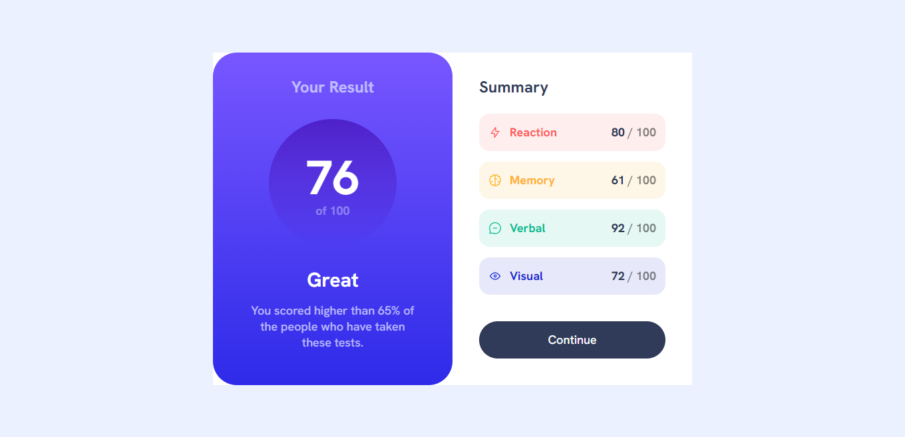

# Frontend Mentor - Results summary component solution

This is a solution to the [Results summary component challenge on Frontend Mentor](https://www.frontendmentor.io/challenges/results-summary-component-CE_K6s0maV). Frontend Mentor challenges help you improve your coding skills by building realistic projects. 

## My experience
In this project I started making the mobile first, it was much easier. I had an idea of putting a transition on the button's color change but I haven't figured out how to do that yet.

### Links

- Solution URL: [https://www.frontendmentor.io/solutions/results-summary-with-tailwind-Ocy12hlWy_](https://www.frontendmentor.io/solutions/results-summary-with-tailwind-Ocy12hlWy_)
- Live Site URL: [https://pricard0.github.io/Results-Summary/](https://pricard0.github.io/Results-Summary/)

### Screenshot

